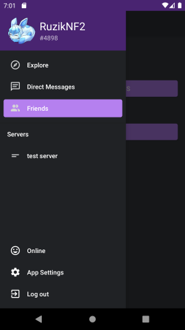

# Гарифуллин Руслан Ильфатович БПИ191
**Клиентское приложение на Android для мессенджера Nexomia**

Ссылка на APK файл: https://github.com/ruslang02/HSE-Android-Labs/releases/download/nexo-1.0/com_devexito_nexomia.apk

Клиент-серверное взаимодействие осуществляется при помощи WebSocket и HTTP API, для проектирования приложения использовалась IDE Android Studio.

